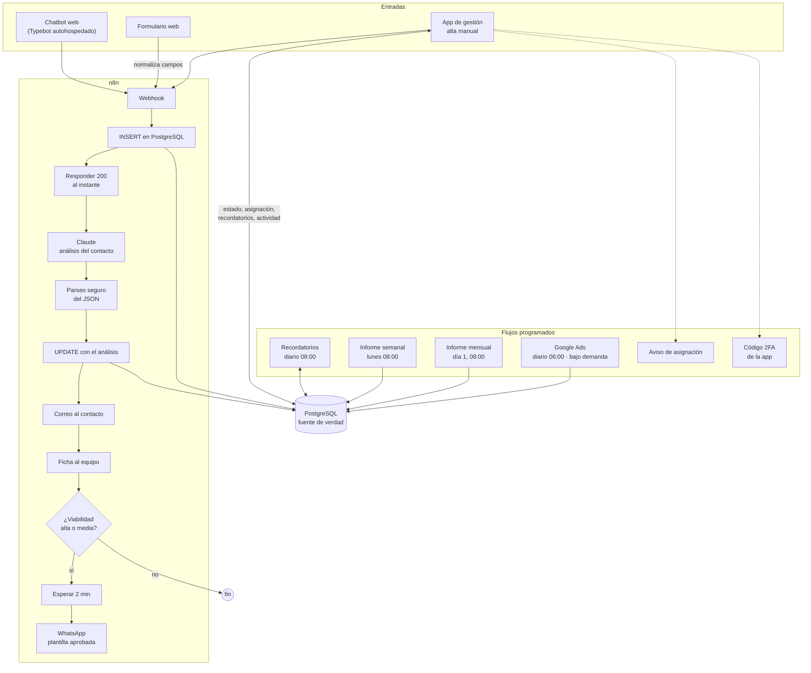

# Sistema de leads con IA · n8n, PostgreSQL, Claude y WhatsApp

> **Caso de estudio.** Sistema de captación y seguimiento de contactos comerciales para una asesoría de A Coruña. Aquí están el problema, la arquitectura, las decisiones técnicas, el [modelo de datos](docs/modelo-datos.md), el [prompt de análisis](docs/prompt-analisis.md) y una [plantilla importable de n8n](snippets/flujo-principal.n8n.json) reescrita desde cero.

## El problema

Los contactos de posibles clientes llegaban por **varios canales**: el chatbot de la web, un formulario y el teléfono o WhatsApp, que el equipo apuntaba a mano. Pasaba lo de siempre:

- **Se respondía tarde.** Si nadie estaba pendiente del canal, la primera respuesta dependía de cuándo se revisaba, y un contacto que no recibe respuesta pronto suele acabar hablando con otros.
- **Nadie sabía cuáles merecían la pena.** Todos los contactos llegaban igual. Revisarlos uno a uno para saber si el caso tenía recorrido llevaba tiempo, y los buenos se mezclaban con los que no encajaban.
- **No había seguimiento.** Quién lo tenía asignado, cuándo había que volver a llamar, qué pasó con él.
- **No había datos.** Cuántos contactos entraban por cada canal, cuántos acababan siendo clientes, qué devolvía cada euro de publicidad.

## La solución

Un sistema de **9 flujos de n8n** alrededor de una base de datos PostgreSQL y una aplicación web de gestión:

1. **Tres entradas, un único registro.** Chatbot, formulario web y alta manual desde la aplicación acaban en la misma tabla, con la **fuente** y los parámetros de campaña (`gclid`, `utm_*`) para medir de dónde viene cada contacto.
2. **Análisis con Claude al momento.** Cada contacto nuevo se clasifica automáticamente: **viabilidad** (alta, media o baja), tipo de caso, resumen y prioridad del 1 al 5. Además, se redacta un correo personalizado para el contacto.
3. **Avisos inmediatos.**
   - El contacto recibe un correo personalizado en segundos.
   - El equipo recibe una ficha con la viabilidad resaltada por colores, el resumen de la IA y los datos de contacto.
4. **WhatsApp condicional.** Si la viabilidad es **alta o media**, a los 2 minutos sale un WhatsApp con una **plantilla aprobada**.
5. **Seguimiento.**
   - Asignación a una persona del equipo, con aviso por correo.
   - Recordatorios programados (1 semana, 15 días o 1 mes) que llegan por correo el día que toca.
   - Registro de actividad de cada cambio.
6. **Informes.** Un informe **semanal** y otro **mensual** por correo, con indicadores, desglose por fuente, estado, servicio y persona, tendencia frente al mes anterior y actividad de cada usuario.
7. **Publicidad.** Sincronización diaria de las métricas de **Google Ads** (impresiones, clics, coste y conversiones por campaña y día) para cruzarlas con los contactos.

## Arquitectura

Componentes (todos **autohospedados** salvo las APIs de Claude, WhatsApp y Google Ads):

| Pieza | Papel |
|---|---|
| n8n | Orquesta los 9 flujos: tres entradas, avisos, recordatorios, informes, Google Ads y el envío del código 2FA de la app |
| PostgreSQL | Fuente de verdad: contactos, usuarios, actividad, métricas de publicidad, códigos 2FA y dispositivos de confianza |
| Typebot | Chatbot conversacional de la web |
| App de gestión | Panel para el equipo: estados, asignación, observaciones, recordatorios y alta manual |
| Claude (Anthropic) | Clasificación del contacto y redacción del primer correo |
| WhatsApp Business (API oficial) | Mensaje de seguimiento con plantilla aprobada |
| Google Ads API | Métricas diarias por campaña |
| SMTP | Correos al contacto y al equipo, recordatorios e informes |

## Decisiones técnicas

### Responder al webhook antes de analizar
El flujo guarda el contacto y **responde 200 en ese momento**. El análisis con IA, los correos y el WhatsApp van después. El chatbot o el formulario no se quedan esperando a un modelo de lenguaje, que puede tardar varios segundos o fallar. Y si falla el análisis, **el contacto ya está guardado**: no se pierde nada.

### PostgreSQL como fuente de verdad
El contacto se escribe en la base **antes** que cualquier otra cosa, y el análisis se guarda con un `UPDATE` sobre esa misma fila. Correos, WhatsApp, recordatorios e informes leen de ahí. Así la aplicación de gestión, los informes y los flujos ven siempre lo mismo, y un aviso que falla no deja datos a medias en ningún otro sitio.

Parte de la limpieza vive **en la propia base**, con triggers `BEFORE INSERT`:

- se normalizan los nombres (espacios y mayúsculas);
- los teléfonos españoles se pasan a un formato único, venga como venga;
- los parámetros de campaña que llegan como `"undefined"` o vacíos se convierten en `NULL`.

Da igual por qué entrada llegue el contacto: el dato se guarda igual.

### Claude con salida JSON y parseo defensivo
El prompt pide **solo JSON** con un formato cerrado: viabilidad, tipo de caso, resumen, prioridad y los párrafos del correo. La respuesta se trata como **no fiable**: se extrae el bloque JSON y, si no se puede leer, se aplican valores seguros (`viabilidad: "pendiente"`, prioridad media). **Un fallo del modelo nunca rompe el flujo ni deja un contacto sin registrar.** Para esta tarea de clasificación basta un modelo rápido y barato (Claude Haiku).

La versión de este repositorio va un paso más allá:
- valida cada campo: viabilidad solo entre los valores permitidos y prioridad entre 1 y 5;
- recorta las longitudes;
- escapa el HTML antes de meter el texto del modelo en el correo.

→ [docs/prompt-analisis.md](docs/prompt-analisis.md) · [snippets/parsear-respuesta-claude.js](snippets/parsear-respuesta-claude.js)

### WhatsApp solo si merece la pena, y con plantilla aprobada
- **Solo viabilidad alta o media.** Un WhatsApp es más invasivo que un correo, así que se reserva para los contactos con recorrido.
- **Plantilla aprobada.** La API oficial de WhatsApp Business solo permite iniciar una conversación con **plantillas aprobadas previamente**. El texto es fijo y solo se rellena el nombre, así que la IA nunca escribe directamente por WhatsApp.
- **Esperar 2 minutos.** El contacto recibe primero el correo y, poco después, el WhatsApp. No llegan los dos a la vez nada más enviar el formulario.

### Consultas parametrizadas
Todo lo que llega de un formulario es texto de un desconocido. En la plantilla, los datos de los contactos entran en SQL **como parámetros** (`$1, $2…`) en todos los nodos, nunca pegados en el texto de la consulta.

### Informes calculados en una sola consulta
Cada informe se calcula con **una única consulta** que devuelve los indicadores y los desgloses ya agregados en JSON (`json_agg`). Un nodo de código solo compone el HTML, con barras dibujadas en CSS en línea para que se vean en cualquier cliente de correo. Las conversiones salen del **registro de actividad** (cambios de estado a «convertido»), no de un contador aparte.

→ [snippets/informe-semanal.sql](snippets/informe-semanal.sql)

### Google Ads con *upsert* idempotente
La sincronización pide los últimos 30 días cada mañana y hace un *upsert* por (fecha, campaña), con un índice único. Repetirla no duplica nada y corrige los datos que Google Ads ajusta con retraso. También se puede lanzar bajo demanda desde un webhook.

### n8n también da servicio a la aplicación
El envío del código de verificación en dos pasos y el aviso de asignación son **webhooks de n8n** que llama la aplicación de gestión. La aplicación no necesita su propia configuración de correo, y todas las plantillas de correo están en el mismo sitio. En la base, los códigos y los dispositivos de confianza se guardan **como hash**, con caducidad y contador de intentos.

## Cómo se construyó

{{pendiente: confirmar cómo se construyó (herramientas, si se usó Claude Code y con qué método)}}

Lo que se ve en el propio sistema:

- **Evolución por versiones.** El flujo principal va por su **cuarta versión**.
- **Todo gira alrededor de los datos.** Las entradas escriben en una única tabla. La aplicación de gestión añade estados, asignación, observaciones y recordatorios. Los informes salen del registro de actividad, y las métricas de Google Ads se guardan junto a los contactos para cruzarlos con la inversión.
- **Reglas de datos en la base.** La normalización de nombres, teléfonos y parámetros de campaña está en triggers de PostgreSQL, no repetida en cada flujo.

## Estado actual

- **En producción**, con los **9 flujos activos**.
- Volumen de contactos, tiempo medio de primera respuesta y tasa de conversión: {{pendiente}}.

## Lo que he aprendido

- **Primero guardar, luego pensar.** Si el análisis con IA va después de responder y de guardar, un fallo del modelo o de la API nunca cuesta un contacto.
- **La salida de un modelo es una entrada no fiable.** Hay que pedir JSON, extraerlo con cuidado, validarlo y tener valores por defecto. Y lo que llega al cliente (el WhatsApp) va con plantilla fija, no con texto generado.
- **Normalizar en la base de datos, no en cada flujo.** Con tres entradas, la limpieza en triggers garantiza que el dato se guarda igual venga de donde venga.
- **Los informes se diseñan desde el registro de actividad.** Guardar cada cambio (quién, qué campo, de qué valor a qué valor) permite medir conversiones y actividad por persona sin tocar la aplicación.
- **Que n8n dé servicio a una aplicación funciona**, siempre que cada webhook esté autenticado y los secretos estén en las credenciales de n8n, no en los nodos.
