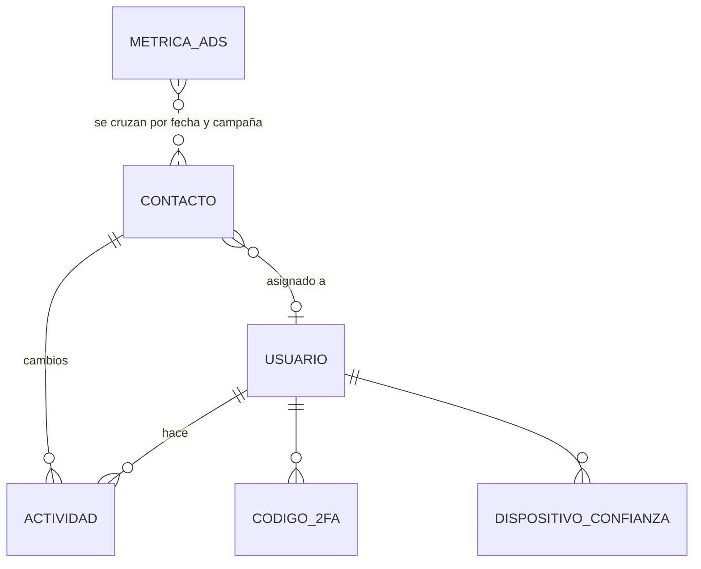

# Modelo de datos

> Estructura a alto nivel, con nombres de campos simplificados. **No hay datos reales.** Todo vive en un esquema propio (`leads`) dentro de PostgreSQL.

## `contactos`

| Grupo | Campos | Notas |
|---|---|---|
| Identificación | `id`, `nombre`, `email`, `telefono` | Un trigger normaliza el nombre y el teléfono al insertar |
| Lo que pide | `servicio`, `horario_preferido`, `mensaje` | Tal como llega de la entrada |
| Origen | `fuente` (`bot`, `formulario`, `whatsapp`…), `gclid`, `utm_source`, `utm_medium`, `utm_campaign`, `utm_term`, `utm_content` | Un trigger convierte `"undefined"` y los vacíos en `NULL` |
| Análisis de la IA | `viabilidad` (`alta`, `media`, `baja` o `pendiente`), `tipo_caso`, `resumen`, `prioridad` (1–5), `correo_enviado` | Se rellenan con un `UPDATE` después del análisis |
| Gestión | `estado` (por defecto `nuevo`), `asignado_a`, `observaciones`, `intentos_contacto_1..3`, `comentario_final` | Los edita el equipo desde la aplicación |
| Recordatorio | `recordatorio` (`1s`, `15d` o `1m`), `recordatorio_fecha`, `recordatorio_enviado` | El flujo diario busca los vencidos y no enviados |
| Tiempos | `creado`, `actualizado` | |

Índices: `email`, `estado`, `creado`.

## `usuarios`

`id`, `nombre`, `email` (único), `password_hash`, `rol` y `roles[]`, `activo` y `creado`.

## `actividad`

Registro de cada acción en la aplicación: `fecha`, `usuario_id` (y nombre y email en el momento del cambio), `accion` (`login`, `lead_update`…), `contacto_id`, `campo`, `valor_anterior` y `valor_nuevo`.

Los informes calculan **conversiones** (cambios de `estado` a «convertido») y **actividad por persona** (accesos, cambios, asignaciones y último acceso) a partir de esta tabla.

Índices: `fecha` y `usuario_id`.

## `metricas_ads`

`fecha`, `campana_id`, `campana_nombre`, `impresiones`, `clics`, `coste`, `conversiones`, `valor_conversiones` y `cargado`.

Índice **único** por (`fecha`, `campana_id`) para que la sincronización diaria sea un *upsert* idempotente.

## `codigos_2fa` y `dispositivos_confianza`

- `codigos_2fa`: `usuario_id`, `codigo_hash`, `caduca`, `intentos`, `usado` y `creado`.
- `dispositivos_confianza`: `usuario_id`, `token_hash`, `caduca` y `creado`.

Ni los códigos ni los tokens se guardan en claro: solo su **hash**.

## Triggers

| Trigger | Cuándo | Qué hace |
|---|---|---|
| `normalizar_contacto` | `BEFORE INSERT` | Quita espacios sobrantes y pone el nombre en formato título. Deja el teléfono español en un formato único, con o sin prefijo |
| `limpiar_marketing` | `BEFORE INSERT` | `NULLIF` de `"undefined"` y de las cadenas vacías en `gclid` y `utm_*` |

El SQL completo está en [snippets/esquema.sql](../snippets/esquema.sql).
